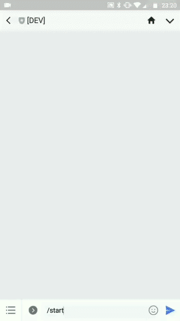

# Weather Bot
Just simple example of flex message from LINE Messaging API with Redis for caching state. This bot using [OpenWeatherMap](https://openweathermap.org) for data source of weather forecast.



## Requirements
 - Node.js >= v8 ([https://nodejs.org](https://nodejs.org))
 - LINE Messaging API ([https://developers.line.me/en](https://developers.line.me/en))
 - OpenWeatherMap API key ([https://openweathermap.org](https://openweathermap.org))
 - Redis ([https://redis.io](https://redis.io))
 - 2 chicken burgers from McDonald's with extra cheese

## Get Started
 - Run `npm install`
 - Define your `.env` based on `.env.example` file
 - Run your redis server
 - Run `npm run serve` for development or `npm start` for production phase

NOTE. Just take a look `/src/controllers` directory and `/src/chatbot.js` module if you want update/add something.

## Folder Structure
```
/dist             # scripts that have been built
/src
  /controllers    # all functional commands
  /utils          # maybe you need this ¯\_(ツ)_/¯
  chatbot.js      # main module for chatbot
  index.js        # main routing app
```

## Available Commands
 - `/start`: View all menu in bot
 - `/current`: View current weather based on specific location
 - `/forecast`: View forecast weather based on specific location

## How to Contribute
 - Create an issue
 - Fork this repository to your GitHub account
 - Make changes
 - Create pull request to this repository

## License
[MIT](./LICENSE.md)

